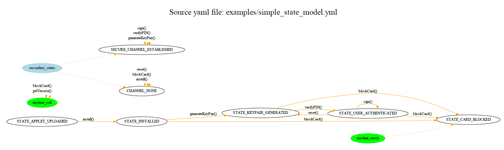

# state_enforcer
Visualize program states transitions and generates enforcing methods (from the provided yaml model) and generates transition checking JavaCard code.

## Usage
  1. Prepare yaml file (e.g., state_model.yml) with specification of state transactions and allowed functions
  2. Run 'state_enforcer.py state_model.yml output_folder_path' (output_folder_path can be directly your source folder )
  3. Analyze resulting pdf file with visualization (state_model.dot.pdf)
  4. If happy, include StateModel.java into your project
  5. Allocate state variable 'StateModel sm = new StateModel(initial_state);'
  6. Copy 'sm.checkAllowedFunction(StateModel.FNC_xyz);' at the beginning of every method xyz
  7. Copy 'sm.changeState(StateModel.desired_new_state);' if you want to change state in the code
  8. Enjoy 

## Example

Use example state model examples\simple_state_model.yml

```yaml
###########################
# GENERAL CONFIGURATION   #
###########################

config:
  package_name: yourpackage

###########################
# SPECIAL STATES AND FNCS #
###########################

states_special:
  anytime_call: [getVersion, blockCard]
  anytime_reach: [STATE_CARD_BLOCKED]

#####################
# STATE TRANSITIONS #
#####################

states_transitions:

  STATE_APPLET_UPLOADED:
    install: STATE_INSTALLED

  STATE_INSTALLED:
    generateKeyPair: STATE_KEYPAIR_GENERATED
    blockCard: STATE_CARD_BLOCKED

  STATE_KEYPAIR_GENERATED:
    verifyPIN: STATE_USER_AUTHENTICATED
    blockCard: STATE_CARD_BLOCKED

  STATE_USER_AUTHENTICATED:
    sign: STATE_USER_AUTHENTICATED
    reset: STATE_KEYPAIR_GENERATED
    blockCard: STATE_CARD_BLOCKED
```

Execute state_enforcer.py which will produce the following files: state_model.dot, state_model.dot.pdf, StateModel.java
 
	state_enforcer.py examples/simple_state_model.yml	

The file [state_model.dot.pdf](examples/state_model.dot.pdf) with visualization is generated (requires [GraphViz](https://graphviz.org) installed)

<p align="center">
    
</p>


The file with transition and function checking enforcement named [StateModel.java](examples/StateModel.java) is generated: 
```java
// Generated by state_enforcer (https://github.com/petrs/state_enforcer) 
package yourpackage;

import javacard.framework.ISOException;

public class StateModel {

    public static final short SW_FUNCTINNOTALLOWED                      = (short) 0x8001;
    public static final short SW_UNKNOWNSTATE                           = (short) 0x8002;
    public static final short SW_UNKNOWNFUNCTION                        = (short) 0x8003;
    public static final short SW_INCORRECTSTATETRANSITION               = (short) 0x8004;


    // States constants
    public static final short STATE_UNSPECIFIED                         = (short) 0x5050;
    public static final short STATE_APPLET_UPLOADED                     = (short) 0x0001;
    public static final short STATE_CARD_BLOCKED                        = (short) 0x0002;
    public static final short STATE_INSTALLED                           = (short) 0x0003;
    public static final short STATE_KEYPAIR_GENERATED                   = (short) 0x0004;
    public static final short STATE_USER_AUTHENTICATED                  = (short) 0x0005;

    // Functions constants
    public static final short FNC_blockCard                             = (short) 0x4001;
    public static final short FNC_generateKeyPair                       = (short) 0x4002;
    public static final short FNC_getVersion                            = (short) 0x4003;
    public static final short FNC_install                               = (short) 0x4004;
    public static final short FNC_reset                                 = (short) 0x4005;
    public static final short FNC_sign                                  = (short) 0x4006;
    public static final short FNC_verifyPIN                             = (short) 0x4007;


    private short STATE_CURRENT = STATE_UNSPECIFIED;

    public StateModel(short startState) {
        STATE_CURRENT = startState;
    }
    
    public void checkAllowedFunction(short requestedFnc) {
        checkAllowedFunction(requestedFnc, STATE_CURRENT);
    }
    
    public short changeState(short newState) {
        STATE_CURRENT = changeState(STATE_CURRENT, newState);
        return STATE_CURRENT;
    }
    
    public short getState() {
        return STATE_CURRENT;
    }

    private static void checkAllowedFunction(short requestedFnc, short currentState) {
        // Check for functions which can be called from any state
        switch (requestedFnc) {
            // case FNC_someFunction:  return;    // enable if FNC_someFunction can be called from any state (typical for cleaning instructions)
            case FNC_getVersion:  return;
            case FNC_blockCard:  return;
        }

        // Check if function can be called from current state
        switch (currentState) {
            case STATE_APPLET_UPLOADED:
                if (requestedFnc == FNC_install) return;
                ISOException.throwIt(SW_FUNCTINNOTALLOWED); // if reached, function is not allowed in given state
                break;
            case STATE_INSTALLED:
                if (requestedFnc == FNC_generateKeyPair) return;
                if (requestedFnc == FNC_blockCard) return;
                ISOException.throwIt(SW_FUNCTINNOTALLOWED); // if reached, function is not allowed in given state
                break;
            case STATE_KEYPAIR_GENERATED:
                if (requestedFnc == FNC_blockCard) return;
                if (requestedFnc == FNC_verifyPIN) return;
                ISOException.throwIt(SW_FUNCTINNOTALLOWED); // if reached, function is not allowed in given state
                break;
            case STATE_USER_AUTHENTICATED:
                if (requestedFnc == FNC_sign) return;
                if (requestedFnc == FNC_reset) return;
                if (requestedFnc == FNC_blockCard) return;
                ISOException.throwIt(SW_FUNCTINNOTALLOWED); // if reached, function is not allowed in given state
                break;
            default:
                ISOException.throwIt(SW_UNKNOWNSTATE);
                break;
       }
    }

    private static short changeState(short currentState, short newState) {
        // Check for states which can be reached from any other state (typically some "cleaning" state)
        switch (newState) {
            //case STATE_ALWAYS_REACHABLE: return newState;
            case STATE_CARD_BLOCKED: return newState;
        }

        switch (currentState) {
            case STATE_APPLET_UPLOADED:
                if (newState == STATE_INSTALLED) return newState;
                ISOException.throwIt(SW_INCORRECTSTATETRANSITION); // if reached, transition is not allowed
                break;
            case STATE_INSTALLED:
                if (newState == STATE_CARD_BLOCKED) return newState;
                if (newState == STATE_KEYPAIR_GENERATED) return newState;
                ISOException.throwIt(SW_INCORRECTSTATETRANSITION); // if reached, transition is not allowed
                break;
            case STATE_KEYPAIR_GENERATED:
                if (newState == STATE_CARD_BLOCKED) return newState;
                if (newState == STATE_USER_AUTHENTICATED) return newState;
                ISOException.throwIt(SW_INCORRECTSTATETRANSITION); // if reached, transition is not allowed
                break;
            case STATE_USER_AUTHENTICATED:
                if (newState == STATE_CARD_BLOCKED) return newState;
                if (newState == STATE_KEYPAIR_GENERATED) return newState;
                if (newState == STATE_USER_AUTHENTICATED) return newState;
                ISOException.throwIt(SW_INCORRECTSTATETRANSITION); // if reached, transition is not allowed
                break;
            default:
                ISOException.throwIt(SW_UNKNOWNSTATE);
                break;
       }
       ISOException.throwIt(SW_INCORRECTSTATETRANSITION); // if reached, transition is not allowed
       return newState;
    }
}
```

